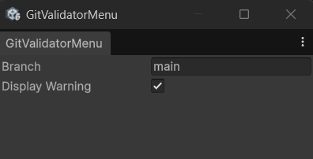
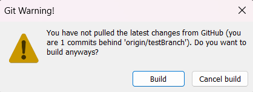

# GitUnityBuildValidator

A Unity Editor tool that validates your Unity builds based on your Git/GitHub branch status. It automatically warns you if your local project is behind the specified remote branch when you try to build, helping you avoid building outdated versions of your project.

## Features
- **Pre-Build Validation:** Intercepts the build process to check your Git repository's status.
- **Customizable Branch:** Specify which branch to validate against (defaults to `main`).
- **Warning Dialog:** Displays a clear warning dialog if you are behind the remote branch, giving you the option to cancel or proceed with the build.

## Installation

### Add package from git URL
1. In Unity, open the Package Manager (**Window > Package Manager**).
2. Click the **+** button in the top left corner.
3. Select **Add package from git URL...**
4. Enter the URL of this repository: `https://github.com/NoaTheSoap/GitUnityBuildValidator.git`
5. Click **Add**.

### Add package from disk (For local development)
1. Clone or download this repository to your computer.
2. In your Unity project, go to **Window > Package Manager**.
3. Click the **+** button in the top left corner.
4. Select **Add package from disk...**
5. Navigate to the downloaded folder and select the `package.json` file.

## Usage

### Configuration
You can configure the validator through its custom Editor window.

1. In the Unity Editor top menu bar, go to **Tools > GitBuildValidator**.
2. This will open the Git Validator settings window.
   

   

3. **Branch:** Enter the name of the branch you want to validate against (e.g., `main`, `development`). The tool will automatically fetch and warn you if you enter a branch that doesn't exist on the remote.
4. **Display Warning:** Toggle this on or off to enable or disable the pre-build warning popup.

### Building
Once configured, the tool works automatically when you build your project (**File > Build Settings > Build**).

- If your local branch is up to date with the remote branch, the build will proceed normally.
- If your local branch is behind the remote setting, a warning dialog will pop up:
  

  
  
  - Click **Build** to ignore the warning and build anyway.
  - Click **Cancel build** to abort the build process so you can pull the latest changes.

## Requirements
- Unity 6000.3 or newer (tested with `6000.3.9f1`).
- Git installed and accessible via your system's command line (ensure Git is added to your PATH environment variable).
